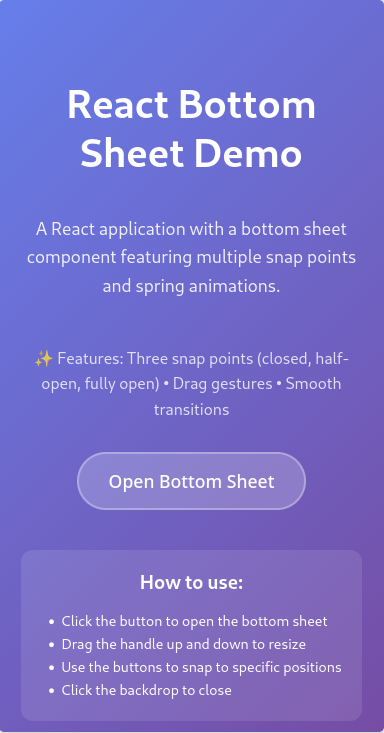
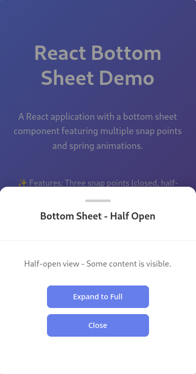
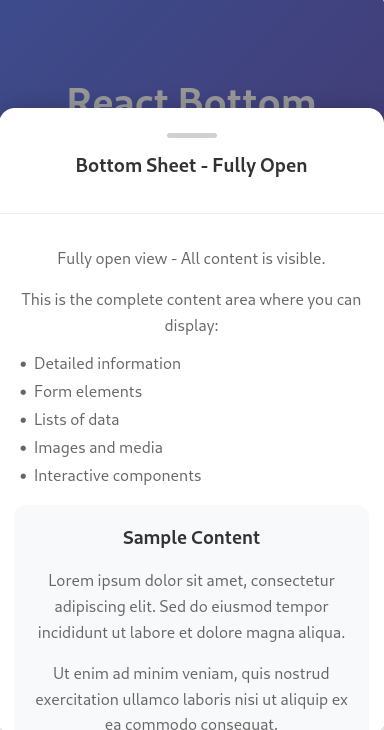

# React Bottom Sheet 📱

A modern, performant React bottom sheet component with smooth spring animations, multiple snap points, and intuitive drag gestures. Perfect for mobile-first applications and responsive designs.

<div align="center">
  
</div>

## ✨ Features

- **🎯 Multiple Snap Points**: Three predefined positions (closed, half-open, fully open)
- **🎪 Spring Animations**: Smooth, physics-based transitions using custom spring animation
- **👆 Drag Gestures**: Intuitive touch and mouse drag support
- **📱 Mobile Optimized**: Touch-friendly with proper gesture handling
- **🚀 Performance**: Optimized with RAF (RequestAnimationFrame) for 60fps animations
- **🎨 Customizable**: Easy to style and extend for your use case
- **♿ Accessible**: Keyboard navigation and screen reader support
- **📖 No Dependencies**: Pure React implementation without external animation libraries

## 🎭 Screenshots

<div align="center">
  <table>
    <tr>
      <td align="center">
        
        <br/>
        <strong>Initial State</strong>
        <br/>
        <em>The main interface with the trigger button</em>
      </td>
      <td align="center">
        
        <br/>
        <strong>Half-Open State</strong>
        <br/>
        <em>Bottom sheet in half-open position</em>
      </td>
      <td align="center">
        
        <br/>
        <strong>Fully Open State</strong>
        <br/>
        <em>Bottom sheet fully expanded with complete content</em>
      </td>
    </tr>
  </table>
</div>

<br/>

<div align="center">
  <h3>🎥 Interactive Demo</h3>
  
  <p><em>Experience smooth animations and intuitive drag gestures</em></p>
</div>

## 🚀 Quick Start

### Prerequisites

- Node.js (v14 or higher)
- npm or yarn

### Installation

1. **Clone the repository**
   ```bash
   git clone https://github.com/muaath-rifath/react-bottom-sheet.git
   cd react-bottom-sheet
   ```

2. **Install dependencies**
   ```bash
   npm install
   # or
   yarn install
   ```

3. **Start the development server**
   ```bash
   npm start
   # or
   yarn start
   ```

4. **Open your browser**
   Navigate to [http://localhost:3000](http://localhost:3000) to see the demo.

## 📖 Usage

### Basic Implementation

```jsx
import React, { useState } from 'react';
import BottomSheet from './components/BottomSheet';

function App() {
  const [isOpen, setIsOpen] = useState(false);

  return (
    <div>
      <button onClick={() => setIsOpen(true)}>
        Open Bottom Sheet
      </button>
      
      <BottomSheet 
        isOpen={isOpen}
        onClose={() => setIsOpen(false)}
      />
    </div>
  );
}
```

### Component Props

| Prop | Type | Required | Description |
|------|------|----------|-------------|
| `isOpen` | `boolean` | ✅ | Controls whether the bottom sheet is visible |
| `onClose` | `function` | ✅ | Callback function called when the sheet should close |

## 🎛️ Snap Points

The component supports three snap points:

- **Closed (0%)**: Bottom sheet is hidden
- **Half (50%)**: Bottom sheet shows partial content
- **Full (85%)**: Bottom sheet shows complete content

### Customizing Snap Points

You can modify the snap points in the `BottomSheet.js` file:

```javascript
const SNAP_POINTS = {
  CLOSED: 0,
  HALF: 50,    // Change this value (0-100)
  FULL: 85     // Change this value (0-100)
};
```

## 🎨 Styling

The component uses CSS classes that you can customize:

- `.bottom-sheet`: Main container
- `.bottom-sheet-backdrop`: Overlay/backdrop
- `.bottom-sheet-header`: Header area with drag handle
- `.bottom-sheet-handle`: Visual drag indicator
- `.bottom-sheet-content`: Content area

### Custom Styling Example

```css
.bottom-sheet {
  border-radius: 20px 20px 0 0;
  box-shadow: 0 -10px 30px rgba(0, 0, 0, 0.1);
}

.bottom-sheet-handle {
  background: #your-brand-color;
  width: 60px;
  height: 6px;
}
```

## ⚙️ Configuration

### Spring Animation Settings

Customize the spring physics in `BottomSheet.js`:

```javascript
const SPRING_CONFIG = {
  tension: 280,    // Stiffness of the spring
  friction: 30,    // Damping force
  mass: 1          // Mass of the object
};
```

### Drag Threshold

Adjust how far a user needs to drag to trigger a snap point change:

```javascript
const DRAG_THRESHOLD = 25; // Percentage of screen height
```

## 📱 Mobile Optimization Features

- **Pull-to-refresh prevention**: Prevents browser pull-to-refresh when dragging
- **Overscroll behavior**: Disables elastic scrolling during interactions
- **Touch event optimization**: Proper touch event handling for smooth performance
- **Viewport awareness**: Responsive to different screen sizes

## 🔧 Development

### Project Structure

```
src/
├── App.js                 # Main application component
├── App.css               # Application styles
├── components/
│   ├── BottomSheet.js    # Bottom sheet component
│   └── BottomSheet.css   # Bottom sheet styles
├── index.js              # Application entry point
└── index.css             # Global styles
```

### Available Scripts

- `npm start` - Starts the development server
- `npm test` - Runs the test suite
- `npm run build` - Builds the app for production
- `npm run eject` - Ejects from Create React App (⚠️ irreversible)

### Testing

Run the test suite:

```bash
npm test
```

### Building for Production

Create a production build:

```bash
npm run build
```

The build folder will contain the optimized production files.

## 🤝 Contributing

Contributions are welcome! Please feel free to submit a Pull Request. For major changes, please open an issue first to discuss what you would like to change.

### Development Guidelines

1. Follow the existing code style
2. Add tests for new features
3. Update documentation as needed
4. Ensure all tests pass before submitting

## 📄 License

This project is licensed under the MIT License - see the [LICENSE](LICENSE) file for details.

## 🙏 Acknowledgments

- Inspired by native mobile bottom sheets
- Built with React 19 and modern web standards
- Uses physics-based spring animations for natural feel

## 📞 Support

If you have any questions or need help, please:

1. Check the [Issues](https://github.com/muaath-rifath/react-bottom-sheet/issues) page
2. Create a new issue if your problem isn't already addressed
3. Provide a clear description and reproduction steps

---

Made with ❤️ by [Muaath Rifath](https://github.com/muaath-rifath)
